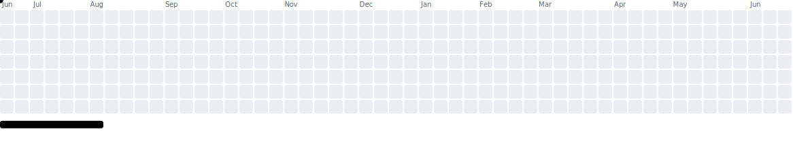

<!-- 浏览量 https://github.com/pudding0503/github-badge-collection -->

  <!--  -->
  <!--  -->

  <!-- 动态显示 -->
  

<!-- 动态打字效果 https://readme-typing-svg.demolab.com/demo/ -->

  

<!-- 个人资料卡 https://github.com/shiinasaku/Github-Card -->
<!-- 

  <picture>
    <source media="(prefers-color-scheme: dark)" srcset="https://card.shiina.xyz/card/Lin-arm?theme=github_dark&animate=true" />
    
  </picture>

  -->

<!-- 属性和语言卡 https://github.com/anuraghazra/github-readme-stats -->
<!-- 

  
  

  -->

<!-- 图标 https://github.com/LelouchFR/skill-icons -->
<!-- 

  

 -->

<!--  -->
<!--  -->
<!--  -->

