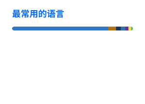
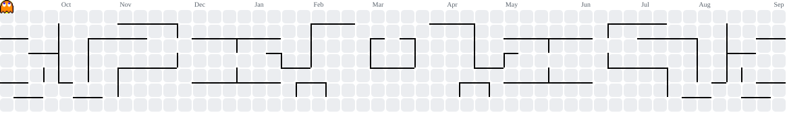
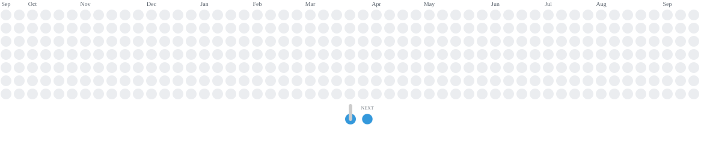
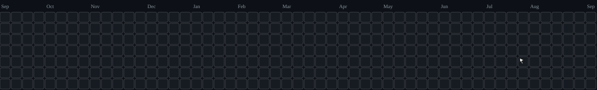
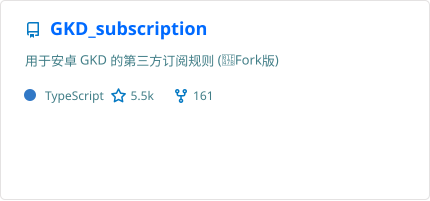

  <!-- 动态打字效果 https://readme-typing-svg.demolab.com/demo/ -->
  
  <!-- 浏览量(动态显示) https://github.com/journey-ad/Moe-counter -->
  

 

<!-- 毒舌 GitHub 评分 -->
<!-- 

  

 -->

<!--  -->
<!--  -->

<!-- 图标 https://github.com/LelouchFR/skill-icons -->

  <a href="https://go-skill-icons.vercel.app/">
    
    <!--  -->
  </a>

<!-- 贡献动画 -->
<!--  -->
<!--  -->
<!--  -->
<!--  -->
<!--  -->
<!--  -->
<!--  -->
<!--  -->
<!--  -->
<!--  -->

<!--  -->
<!--  -->

 

## 📌置顶项目

<!--  -->
